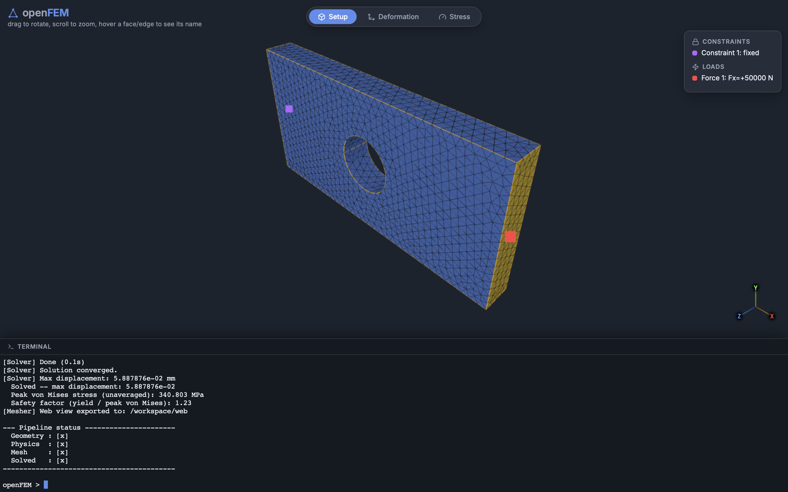
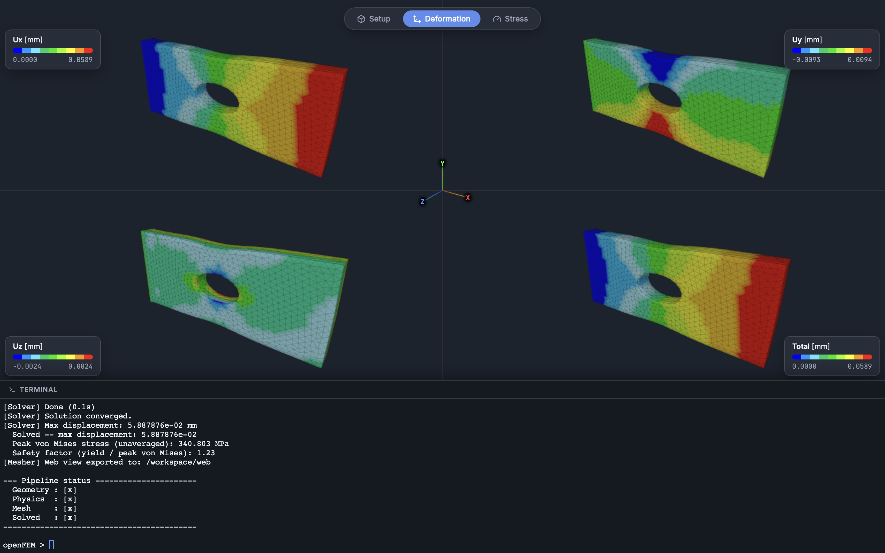
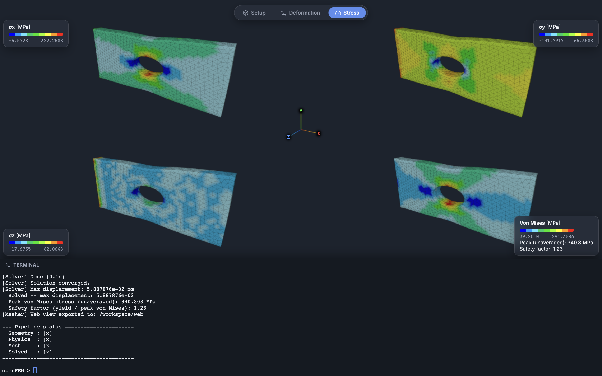

<p align="center">
  
</p>

<p align="center">
  A browser-based Finite Element Analysis tool for mechanical parts.<br>
  Load a STEP file, mesh it, apply constraints and loads, solve, and see the
  deformed shape and stress directly in your browser — no desktop CAD/FEA
  software, no manual setup.
</p>

---

## What it does

```
STEP file (CAD)  →  mesh (gmsh)  →  constraints + loads  →  solve  →  results
```

Everything runs inside a single Docker container, driven from one browser tab
that shows both the 3D viewer and a real terminal — no separate windows, no
host-side toolchain to install.

- **CAD import** — reads STEP files via OpenCASCADE, no manual cleanup needed.
- **Meshing** — tetrahedral meshing via gmsh, with automatic mesh-size
  fallback if a requested size is too heavy to compute in time.
- **Constraints & loads** — fixed/pinned/custom (per-DOF) boundary
  conditions, point forces and pressure loads, distributed by tributary
  area/length rather than split evenly per node.
- **Solver** — direct sparse solve (Eigen), with a live progress readout for
  large systems.
- **Results** — deformed shape (Ux/Uy/Uz/Total) and stress (σx/σy/σz/Von
  Mises) views, each as a 4-way split so all components are visible at once,
  plus the true peak stress and resulting safety factor against the
  material's yield strength.
- **Snapshots** — save a solved result under a name and bring it back later
  in the viewer, without re-solving anything.

## Screenshots

**Setup** — hover any face/edge to see its name, with constraints/loads
marked directly on the geometry.



**Deformation** — exaggerated deformed shape, Ux/Uy/Uz/Total side by side.



**Stress** — σx/σy/σz/Von Mises, with the peak (unaveraged) stress and
safety factor shown next to the Von Mises panel.



## Quickstart

```bash
git clone https://github.com/Destrot1/openFEM.git
cd openFEM
docker compose up -d --build
```

Then open **http://localhost:8081/** — the 3D viewer is on top, a real
terminal (already running the CLI) is docked at the bottom. Type `load`,
point it at a STEP file, and follow the prompts.

The first start compiles the C++ project automatically (can take a couple of
minutes); every start after that is fast, since the build is incremental.

See **[docs/commands.md](docs/commands.md)** for the full command reference
(Docker operations + every CLI command).

## Documentation

- **[docs/commands.md](docs/commands.md)** — every command you'll actually
  type, for running the container and for driving the CLI.
- **[docs/architecture.md](docs/architecture.md)** — how the project is
  organized: folder layout and what each part is responsible for.

## Tech stack

C++17 · [gmsh](https://gmsh.info/) (meshing) · [OpenCASCADE](https://dev.opencascade.org/) (STEP import) ·
[Eigen](https://eigen.tuxfamily.org/) (linear algebra) · [Three.js](https://threejs.org/) (web viewer) ·
[ttyd](https://github.com/tsl0922/ttyd) (browser terminal) · Docker
